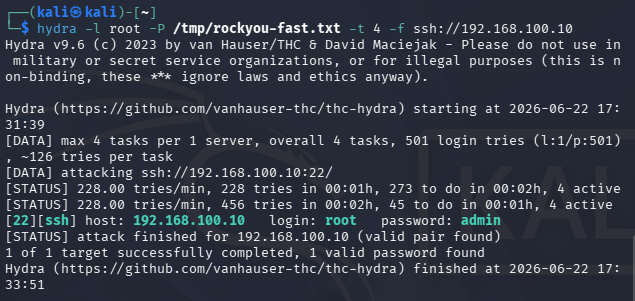
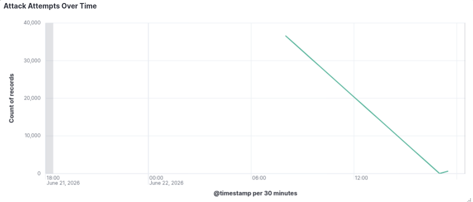
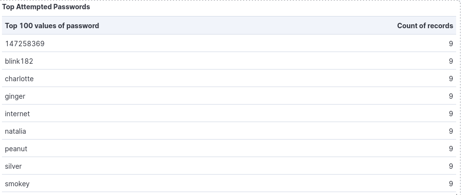
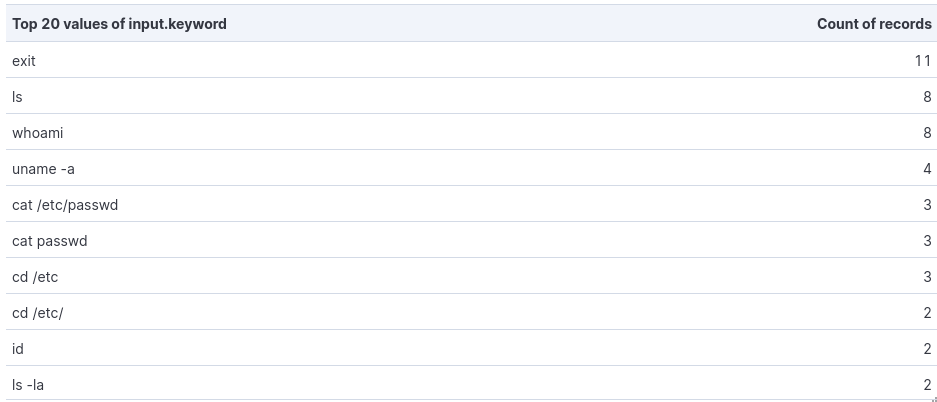
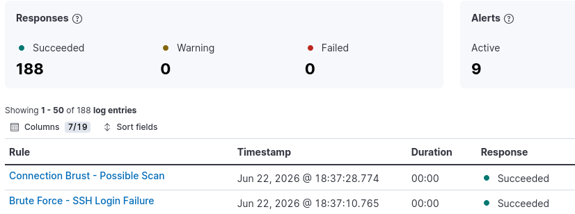

# Honeypot + SIEM — Attack Analysis Report

**Author:** Oussema BEN SALAH  
**Institution:** Enet'Com — École Nationale d'Électronique et des Télécommunications de Sfax  
**Date:** June 2026  
**Project:** Cowrie SSH Honeypot + ELK Stack SIEM Integration

---

## 1. Project Overview

This project deploys a Cowrie SSH honeypot on an isolated VirtualBox lab to attract, capture, and analyze simulated attacker behavior. Logs generated by the honeypot are shipped in real time to an ELK Stack SIEM (Elasticsearch, Logstash, Kibana) for indexing, visualization, and automated alerting. The goal is to study attacker tactics — credential choices, post-login recon sequences, and command patterns — and build a functional security monitoring pipeline from scratch at zero cost.

---

## 2. Lab Architecture

### VM Topology

| VM | OS | IP Address | RAM | Role |
|---|---|---|---|---|
| honeypot (web-serv01) | Ubuntu Server 24.04 | 192.168.100.10 | 2 GB | Cowrie SSH Honeypot |
| elk-siem | Ubuntu Server 24.04 | 192.168.100.20 | 6 GB | ELK Stack SIEM |
| kali | Kali Linux 2026.1 | 192.168.100.30 | 3 GB | Attacker Simulation |

All three VMs are connected on a VirtualBox internal network (`intnet`), completely isolated from the host machine's external network.

### Data Flow

```
Attacker (Kali)
      │
      │  SSH attempts → port 22
      ▼
Cowrie Honeypot (192.168.100.10)
      │  iptables NAT redirects port 22 → 2222 (Cowrie)
      │  logs written to cowrie.json
      ▼
Filebeat → ships logs to Logstash
      │
      ▼
Logstash (192.168.100.20)
      │  parses JSON, maps fields, adds src_ip_str keyword copy
      ▼
Elasticsearch → stores in cowrie-YYYY.MM.DD index
      │
      ▼
Kibana → dashboard + alerting rules
```


---

## 3. Attack Simulation

### Brute Force Attack

Attack simulation was performed using **Hydra** from the Kali VM against the honeypot's SSH port (port 22, intercepted by Cowrie via iptables NAT).

```bash
hydra -l root -P /tmp/rockyou-fast.txt -t 8 -f ssh://192.168.100.10
```

Hydra attempted multiple username/password combinations in parallel (`-t 8` threads), logging each failed and successful attempt. Cowrie captured every attempt — including the exact credentials tried — without the attacker ever touching the real system.

**Result:** Hydra confirmed a successful login with `root:admin`. All attempts and the final success event were logged and appeared on the Kibana dashboard in near real time.






---

## 4. Findings

### 4.1 Weak Password Patterns

Analysis of the captured login attempts reveals consistent patterns in attacker credential choices:

- **Username:** `root` is the first and most common target. Attackers prioritize root because a successful login grants immediate full system access with no privilege escalation required.
- **Password list:** Common passwords like `123456`, `password`, `root`, and short keyboard patterns dominate the top attempts. These appear in the first few hundred lines of any standard wordlist.
- **Key observation:** The password `admin` — which succeeded — does not appear in the top 5,000 most common passwords in rockyou.txt (it sits at line ~19,819). This illustrates that many real attackers use full or extended wordlists, making even moderately obscure passwords vulnerable given enough time.



### 4.2 Post-Login Recon Command Sequence

After a successful login, Cowrie captured the following command sequence executed by the attacker:

```
whoami
id
uname -a
cat /etc/passwd
cat /etc/shadow
```

This is a textbook **initial access → discovery** sequence. Each command serves a specific reconnaissance purpose:

| Command | Purpose |
|---|---|
| `whoami` | Confirm current user identity |
| `id` | Check user ID, group memberships, and privileges |
| `uname -a` | Fingerprint the OS version and kernel |
| `cat /etc/passwd` | Enumerate all system users |
| `cat /etc/shadow` | Attempt to extract password hashes |

The sequence follows a logical escalation — confirm access, understand the environment, then harvest credentials for further use or lateral movement.



### 4.3 Alert Correlation

Both Kibana alerting rules fired simultaneously during the brute force simulation:

- **Brute Force — SSH Login Failures:** triggered when failed login count exceeded 10 in a 5-minute window
- **Connection Burst — Possible Scan:** triggered when connection count exceeded 5 in a 1-minute window

The simultaneous firing is **expected** — Hydra opens a new TCP connection per attempt, so a brute force attack always generates both a connection burst and a login failure spike at the same time. This is standard SOC behavior: multiple rules alerting on the same source IP is a signal for alert correlation, pointing to a single coordinated attack rather than isolated events.




---

## 5. IOC Summary

The following indicators of compromise were observed during the simulated attack session:

| IOC Type | Value | Context |
|---|---|---|
| Attacker IP | `192.168.100.30` | Source of all brute force attempts |
| Target IP | `192.168.100.10` | Honeypot — Cowrie SSH |
| Target Port | `22/tcp` | SSH (redirected to Cowrie via iptables) |
| Protocol | SSH | |
| Attack Type | Credential brute force | Hydra, 8 parallel threads |
| Username targeted | `root` | All attempts used this username |
| Successful credential | `root:admin` | Only combination that succeeded |
| Login failures | 500+ | Before successful login |
| Post-login commands | `whoami`, `id`, `uname -a`, `cat /etc/passwd`, `cat /etc/shadow` | Discovery & credential access |

---

## 6. MITRE ATT&CK Mapping

| Technique | ID | Observed Behavior |
|---|---|---|
| Brute Force: Password Guessing | T1110.001 | Hydra cycling through wordlist against SSH |
| Valid Accounts | T1078 | Successful login with `root:admin` |
| System Owner/User Discovery | T1033 | `whoami` and `id` executed post-login |
| System Information Discovery | T1082 | `uname -a` to fingerprint the OS |
| Account Discovery: Local Account | T1087.001 | `cat /etc/passwd` to enumerate users |
| OS Credential Dumping | T1003 | `cat /etc/shadow` attempt |

---

## 7. What a Real Attacker Would Do Next

Based on the captured recon sequence, a real attacker with a confirmed `root` shell would logically proceed as follows:

**Persistence** — the first priority after gaining access is ensuring they can return even if the password is changed. This typically involves adding an SSH public key to `/root/.ssh/authorized_keys`, creating a new backdoor user, or deploying a cron-based reverse shell.

**Lateral Movement** — with `/etc/passwd` and `/etc/shadow` harvested, the attacker would attempt to crack other user password hashes offline and reuse credentials across other systems on the same network. In a real environment, this is how a single compromised host becomes a full network breach.

**Data Exfiltration** — sensitive files (configurations, credentials, database dumps) would be compressed and exfiltrated to a remote C2 server, typically over common ports (80, 443) to blend in with normal traffic.

**Covering Tracks** — log files would be cleared (`/var/log/auth.log`, bash history wiped with `history -c`), and any installed tools would be removed to slow forensic investigation.

In this lab, Cowrie prevents all of these actions by simulating a fake filesystem — no real data is at risk, but the full attacker intent is captured and logged.

---

## 8. Detection Limitations

This setup has several inherent limitations worth acknowledging:

**Polling-based alerting delay** — Kibana's rule engine runs on a fixed schedule (every 1 minute in this lab). This means there is up to a 60-second gap between an attack occurring and an alert firing. Production SOC environments use streaming pipelines or dedicated alerting engines for sub-second detection.

**SYN scans are invisible** — Nmap's default scan (`-sS`, SYN scan) never completes the TCP three-way handshake and therefore never reaches Cowrie. It is intercepted purely at the kernel level and generates no Cowrie log events. Only connect scans (`-sT`) and service scans (`-sV`) are visible to the honeypot.

**Self-generated traffic only** — all attacks in this lab originate from a controlled Kali VM. Real honeypot deployments are exposed to the internet and receive organic attack traffic from global sources, which provides far richer and more diverse datasets.

**Single-service honeypot** — Cowrie only emulates SSH and Telnet. A real attacker probing for web vulnerabilities, RDP, SMB, or other services would generate no logs in this setup.

---

