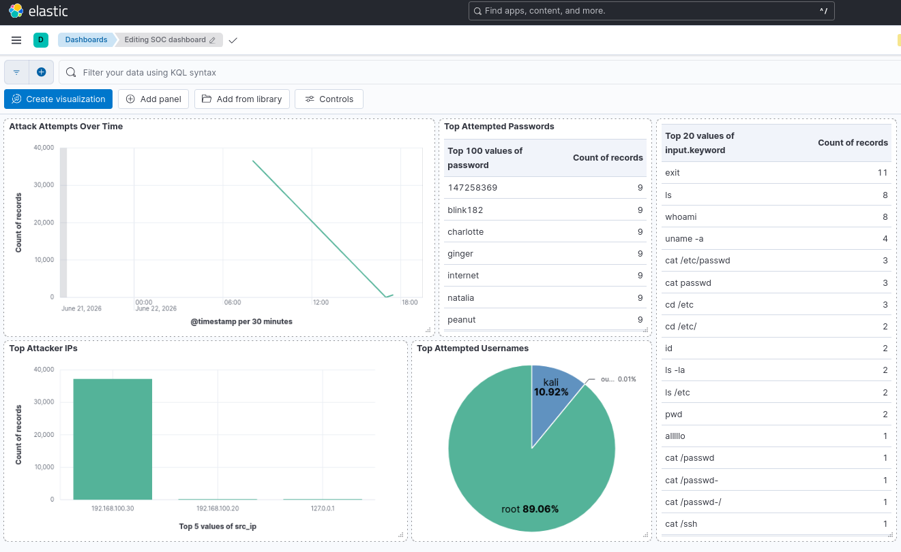
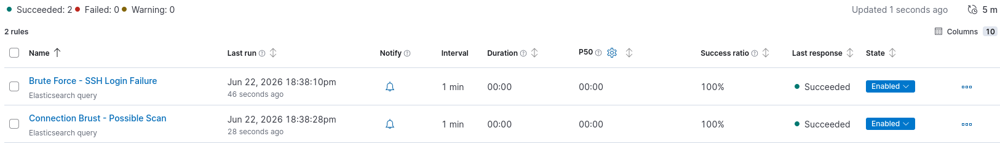

# Honeypot + SIEM Lab

A fully functional SSH honeypot integrated with an ELK Stack SIEM, built from scratch on a local VirtualBox lab. The project captures simulated attacker sessions, parses and indexes logs in real time, visualizes attack patterns on a Kibana dashboard, and triggers automated alerting rules.


---

## Overview

| | |
|---|---|
| **Honeypot** | Cowrie SSH (emulates a real Linux system) |
| **SIEM** | ELK Stack — Elasticsearch + Logstash + Kibana |
| **Log shipper** | Filebeat |
| **Attack simulation** | Hydra + Nmap from Kali Linux |
| **Cost** | $0 |
| **Environment** | VirtualBox — fully isolated internal network |

---

## Architecture

```
Attacker (Kali)  ──SSH :22──►  Cowrie Honeypot  ──Filebeat──►  Logstash  ──►  Elasticsearch  ──►  Kibana
192.168.100.30                  192.168.100.10                              192.168.100.20
```

Port 22 on the honeypot is intercepted by an iptables NAT rule and redirected to Cowrie on port 2222. No real SSH daemon is exposed. Every login attempt, successful session, and post-login command is captured and logged to `cowrie.json`.

---

## Features

- **Cowrie honeypot** — emulates a full Linux shell, captures credentials and commands
- **Real-time log pipeline** — Filebeat → Logstash → Elasticsearch, fully automated
- **Custom index template** — explicit field mappings for `src_ip` (ip type), `src_ip_str` (keyword copy), `username`, `password`, `eventid`
- **Kibana dashboard** — 5 panels: attack attempts over time, top attacker IPs, top usernames, top passwords, executed commands
- **Automated alerting rules**
  - Brute Force: >10 failed logins in 5 minutes
  - Connection Burst: >5 connections in 1 minute
- **Network hardening** — UFW with conntrack-based rules, NAT persistence

---

## Dashboard



---

## Kibana Alerting


> 📸 **[screenshot: Rules page — both rules Enabled]**

> 📸 **[screenshot: Rules Logs — Active alerts firing]**

---

## Lab Setup

### VM Topology

| VM | OS | IP | RAM | Role |
|---|---|---|---|---|
| honeypot | Ubuntu Server 24.04 | 192.168.100.10 | 2 GB | Cowrie SSH Honeypot |
| elk-siem | Ubuntu Server 24.04 | 192.168.100.20 | 6 GB | ELK Stack SIEM |
| kali | Kali Linux 2026.1 | 192.168.100.30 | 3 GB | Attacker Simulation |

All VMs run on a VirtualBox internal network (`intnet`), isolated from the host machine's internet connection.


---

## Attack Analysis

Full attack analysis, MITRE ATT&CK mapping, IOC summary, and detection limitations are documented in [`ANALYSIS.md`](./ANALYSIS.md).

---

## Roadmap

- [ ] Expose honeypot to the internet and capture real organic attack traffic
- [ ] Add Telnet emulation (Cowrie supports this natively)
- [ ] Add a Python script to auto-generate IOC reports from Cowrie logs
- [ ] Integrate GeoIP enrichment in Logstash for attacker location mapping
- [ ] Experiment with AI-assisted alert filtering to reduce noise
- [ ] Add Wazuh as a secondary SIEM layer for comparison

---

## References

- [Cowrie Documentation](https://cowrie.readthedocs.io)
- [ELK Stack Docs](https://www.elastic.co/guide)
- [MITRE ATT&CK](https://attack.mitre.org)

---

*Oussema BEN SALAH · Enet'Com Sfax · 2026*
